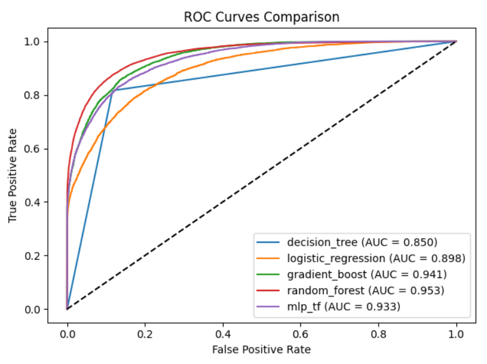

# 🏨 Hotel Cancellation Prediction

Este repositorio contiene un pipeline completo de Machine Learning para **predecir la cancelación de reservas de hotel**. El objetivo principal es dotar a los hoteles de una herramienta que les permita identificar proactivamente las reservas con alta probabilidad de ser canceladas, facilitando la toma de decisiones para optimizar la ocupación y los ingresos.

El proyecto abarca desde el análisis exploratorio de datos (EDA) hasta la comparación y evaluación de diversos modelos de aprendizaje automático, siguiendo las mejores prácticas de modularidad y calidad de código.

---

**📊 ¡Accede al Reporte Interactivo de Resultados en GitHub Pages!**
[Haz clic aquí para ver el análisis detallado de métricas, curvas ROC y conclusiones del modelo.](TU_URL_DE_GITHUB_PAGES_AQUI)

---
## 🎯 Objetivo y Estrategia de Evaluación

El objetivo de este proyecto es construir un modelo predictivo robusto que ayude a los hoteles a minimizar las pérdidas asociadas a las cancelaciones de reservas. Predecir con antelación si una reserva será cancelada permite implementar estrategias como:

* **Overbooking inteligente:** Ajustar la capacidad de reservas para compensar las cancelaciones esperadas.
* **Ofertas personalizadas:** Contactar a clientes con alto riesgo de cancelación para ofrecerles incentivos y retener la reserva.
* **Optimización de recursos:** Planificar mejor el personal y los recursos del hotel al tener una estimación más precisa de la ocupación real.

### Justificación de la Métrica Principal: AUC-ROC

Dada la naturaleza del problema de negocio y el **desbalance de clases** inherente (generalmente hay menos cancelaciones que reservas completadas), hemos elegido la **Área Bajo la Curva ROC (AUC-ROC)** como nuestra métrica de evaluación principal por las siguientes razones:

1.  **Manejo del Desbalance de Clases:** La AUC-ROC es robusta frente a datasets desbalanceados, ya que evalúa el rendimiento del clasificador en todos los posibles umbrales de clasificación. A diferencia de métricas como la *Accuracy*, no se ve sesgada por la clase mayoritaria.
2.  **Capacidad de Ranking:** Mide la capacidad del modelo para distinguir entre las clases positiva (cancelación) y negativa (no cancelación). Una AUC-ROC alta indica que el modelo es bueno asignando una mayor probabilidad a las reservas que finalmente se cancelarán, lo que es crucial para estrategias proactivas que requieren clasificar y priorizar riesgos.
3.  **Independencia del Umbral:** Permite evaluar el rendimiento general del modelo sin necesidad de fijar un umbral de clasificación específico. Esto es vital en un contexto de negocio donde el coste de un Falso Positivo (FP) o Falso Negativo (FN) puede variar y el umbral óptimo podría ajustarse dinámicamente. Al tener un modelo con alta AUC-ROC, la empresa puede elegir el umbral que mejor se adapte a su estrategia de negocio en un momento dado (por ejemplo, priorizando minimizar FN para evitar pérdidas, o minimizando FP para no contactar innecesariamente a clientes).

Si bien otras métricas como Precision, Recall y F1-score se calculan y visualizan en el reporte (`02_reporting.ipynb`) para ofrecer una visión completa, la AUC-ROC es el indicador fundamental de la capacidad discriminatoria del modelo para este caso de uso.

## 📁 Estructura del Proyecto y Modularidad

El repositorio está organizado de forma modular para facilitar la claridad, el mantenimiento y la escalabilidad del proyecto. Cada componente tiene una responsabilidad específica, permitiendo una fácil comprensión y modificación sin afectar otras partes del pipeline.
```
hotel-cancellation-prediction/
├── data/
│   ├── raw/                       # Datos originales
│   └── processed/                 # Datos limpios y preprocesados
├── notebooks/
│   ├── 01_EDA.ipynb               # Análisis Exploratorio de Datos
│   └── 02_reporting.ipynb         # Reporte de resultados
├── pictures/                      # Imágenes adicionales para el README
├── src/
│   ├── clean_data.py              # Limpieza inicial de datos
│   ├── config.py                  # Parámetros y constantes globales
│   ├── data_loader.py             # Funciones para cargar y dividir datos
│   ├── preprocess.py              # Preprocesado de características (imputación, escalado, encoding, SMOTE)
│   ├── train.py                   # Entrenamiento de modelos inicial
│   ├── tune.py                    # Optimización de hiperparámetros (GridSearchCV)
│   ├── evaluate.py                # Evaluación de métricas de modelos
│   ├── evaluate_final.py          # Evaluación final de modelos optimizados
│   ├── visualize.py               # Funciones para guardar gráficos y resúmenes
│   └── model_zoo/                 # Implementaciones modulares de los modelos (Model Zoo)
│       ├── decision_tree.py
│       ├── logistic_regression.py
│       ├── gradient_boost.py
│       ├── random_forest.py
│       └── mlp_tf.py              # Modelo MLP con TensorFlow/Keras
├── reports/
│   ├── figures/                   # Imágenes generadas (Curvas ROC, Matrices de Confusión)
│   ├── roc_csv/                   # CSVs con datos para Curvas ROC por modelo
│   ├── auc_comparison.csv         # Resumen comparativo de AUC-ROC de todos los modelos
│   └── 02_reporting.html          # Reporte exportado del notebook 02_reporting
├── docs/
│   └── 02_reporting.html          # Contiene el reporte HTML para GitHub Pages
├── models/                        # Modelos serializados (.joblib) y preprocesador
├── README.md                      # Este archivo
└── requirements.txt               # Dependencias del proyecto
```

### Concepto de "Model Zoo" y Modularidad

Para cumplir con el requisito de **modularidad y el uso de un "model zoo"**, cada algoritmo de Machine Learning se ha implementado en un archivo `.py` independiente dentro de la carpeta `src/model_zoo/`.

Cada archivo (`decision_tree.py`, `logistic_regression.py`, `gradient_boost.py`, `random_forest.py`, `mlp_tf.py`) contiene una función `build_model()` que devuelve una instancia del clasificador con parámetros por defecto o configurables vía `kwargs`. Esto permite:

* **Reutilización:** Los modelos pueden ser importados y utilizados fácilmente en diferentes partes del pipeline (entrenamiento, tuning, evaluación) sin duplicar código.
* **Facilidad de Extensión:** Añadir un nuevo modelo es tan sencillo como crear un nuevo archivo en `src/model_zoo/` con su función `build_model()`.
* **Claridad:** La lógica de cada modelo está encapsulada, lo que mejora la legibilidad del código base.

### Serialización y Guardado de Modelos

Los modelos entrenados y el objeto `ColumnTransformer` utilizado para el preprocesado de datos se **serializan y guardan en el directorio `models/`**.

* El `ColumnTransformer` (encapsulando la imputación, escalado y One-Hot Encoding) se guarda durante la fase de preprocesado en `src/preprocess.py`. Esto asegura que las transformaciones aplicadas a los datos de entrenamiento sean replicables exactamente en los datos de validación y test, y crucialmente, en futuras inferencias con datos nuevos.
* Cada modelo entrenado (inicialmente en `src/train.py` y luego los modelos optimizados con `GridSearchCV` en `src/tune.py`) se guarda en formato `.joblib`. Esto permite cargar los modelos directamente para su evaluación o despliegue, sin necesidad de reentrenarlos.

Este enfoque de serialización garantiza la persistencia del estado del pipeline de preprocesado y de los modelos, facilitando la reproducibilidad y el despliegue en entornos de producción.

## ⚙️ Instalación

Para configurar el entorno y ejecutar el proyecto, sigue estos pasos:

1.  **Clonar el repositorio:**
    ```bash
    git clone https://github.com/anabbre/hotel-cancellation-prediction.git
    cd hotel-cancellation-prediction
    ```

2.  **Crear y activar un entorno virtual:**
    ```bash
    python -m venv .venv
    # En Windows:
    .\.venv\Scripts\activate
    # En Linux/macOS:
    source .venv/bin/activate
    ```

3.  **Instalar las dependencias:**
    ```bash
    pip install -r requirements.txt
    ```

## 🚀 Instalación y Ejecución del Pipeline

Una vez que el entorno esté configurado, puedes ejecutar el pipeline completo para generar los datos limpios, entrenar y tunear los modelos, y producir los reportes de evaluación.

1.  **Asegúrate de que el dataset original** `dataset_practica_final.csv` esté ubicado en `data/raw/`.

2.  **Ejecutar el pipeline completo:**
    El script `run_pipeline.py` orquesta la ejecución de los módulos principales: `train.py`, `tune.py`, y `evaluate_final.py`.

    ```bash
    python run_pipeline.py
    ```
    Este comando realizará automáticamente:
    * Carga y limpieza de datos (si no existe `dataset_limpio.csv` en `data/processed/`).
    * División del dataset en conjuntos de entrenamiento, validación y test.
    * Preprocesado de datos (imputación, escalado, One-Hot Encoding) y guardado del `ColumnTransformer`.
    * Entrenamiento inicial de todos los modelos del `Model Zoo` y guardado en `models/`.
    * Optimización de hiperparámetros mediante `GridSearchCV` para cada modelo (excepto MLP) y guardado de los mejores modelos en `models/` (con sufijo `_best.joblib`).
    * Evaluación final de los modelos optimizados en el conjunto de test y guardado de las métricas en `reports/final_metrics.csv` y `reports/auc_comparison.csv`.
    * Generación de curvas ROC y matrices de confusión en `reports/figures/`.

3.  **Explorar los resultados:**
    * Los notebooks `01_EDA.ipynb` y `02_reporting.ipynb` pueden ser abiertos con Jupyter Lab o VS Code para explorar el análisis y los resultados de forma interactiva.
    * El reporte HTML (`reports/02_reporting.html`) es una versión estática del notebook de reporte.

## 📊 Resultados Clave y Valor de Negocio

Tras la evaluación de los diferentes modelos, el **Random Forest Classifier** ha demostrado ser el de mejor rendimiento para la predicción de cancelaciones de hotel, obteniendo la siguiente métrica principal en el conjunto de test:

* **AUC-ROC: 0.953**

Para una visión del rendimiento comparativo de los modelos en términos de AUC-ROC, consulta la gráfica a continuación. Random Forest muestra la curva más cercana a la esquina superior izquierda, indicando su superioridad:



### Impacto en el Negocio

El modelo de Random Forest, con una impresionante AUC-ROC de 0.954, representa una herramienta predictiva de gran valor estratégico para la gestión hotelera. Su implementación se traduce en beneficios tangibles:

* **Mejor toma de decisiones:** Proporciona al equipo de gestión de reservas una capacidad mejorada para identificar con alta precisión qué reservas tienen un mayor riesgo de ser canceladas. Esta inteligencia permite anticiparse a los eventos y no solo reaccionar a ellos.
* **Minimización de pérdidas:** Al predecir cancelaciones, los hoteles pueden aplicar un overbooking inteligente y contactar proactivamente a clientes de alto riesgo con ofertas personalizadas o incentivos, reduciendo las vacantes inesperadas y maximizando la ocupación y los ingresos.
* **Eficiencia operativa:** La capacidad de prever las cancelaciones mejora significativamente la planificación de recursos (personal de limpieza, recepción, gestión de inventarios, preparación de habitaciones), lo que conduce a una asignación más eficiente y una operación más fluida.

En resumen, este sistema no solo predice la cancelación, sino que proporciona inteligencia accionable fundamental para una gestión de reservas más eficiente, estratégica y, en última instancia, más rentable.

Para un análisis detallado de todas las métricas, matrices de confusión y curvas ROC individuales, por favor, consulta el notebook `notebooks/02_reporting.ipynb` o el reporte HTML `reports/02_reporting.html`.

---

## ✍️ Autores y Roles

- **Ana Belén Ballesteros** – EDA, limpieza y preprocesado; modelado (src/model_zoo); reporting (notebooks, visualizaciones, README)
- **Victor Martínez** – Tuning y evaluación (src/tune.py, src/evaluate.py); integraciones con TensorFlow; merges y pipeline refactor. 

Trabajo realizado de manera colaborativa en todas las fases: diseño del pipeline, desarrollo de scripts, validación de resultados y redacción de la documentación.”
